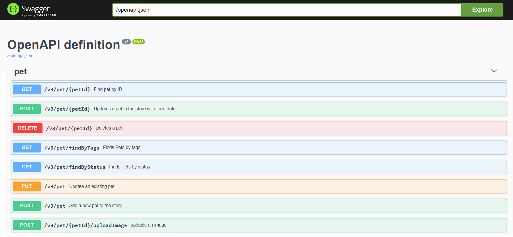

# ch3

Swagger API 문서 연동

> [Spring swagger 3 사용방법(springdoc-openapi-ui)](https://wildeveloperetrain.tistory.com/156)



API 주소 설계

> /버전/도메인/옵션:속성값/상세

예시

get /v3/pet/{petId} : ID기준 검색
get /v3/pet/findByStatus : status 기준 검색
post /v3/pet : 신규 등록
post /v3/pet/{petId} : 폼데이터를 사용하여 정보 업데이트
post /v3/pet/{petId}/uploadImage : 이미지 업로드
put /v3/pet/{petId} : 정보 변경 by ID
delete /v3/pet/{petId} : ID기준 삭제

## 어노테이션

@Api

```txt
(tags = {"1. User"})
제목 역활을 한다
```

@ApiOperation

```txt
(value = "모든 회원 조회", notes = "모든 회원 목록을 조회합니다.")
value는 리스트로 봤을 때 간단하게 보이는 용도
notes는 펼쳐봤을 때 자세히 알려주는 용도
```

@ApiParam

```txt
(value = "회원 이메일", required = true) @RequestParam String email
ApiParam은 Swagger에서 설명을 붙이기 위한 용도이다. value는 설명, required는 필수값 설정 여부
```

@RequestParam

```txt
HTTP GET 메소드에서 매칭되는 request parameter값이 자동으로 들어간다.
url뒤에 쿼리로 붙는 값을 가져올 때 사용한다
https://localhost:8080/user?name=woonsik&email=dnstr@email.com
```

@RequestParam("{vlaue}")

```txt
{value}가 실제로 전달하는 인자의 이름이 된다. -> "{value}=값"
```

@PathVariable

```txt
HTTP 요청에서 매칭되는 request parameter값이 자동으로 들어간다.
단, 쿼리가 아니라 url에 추가되어서 전달된다.
http://localhost:8080/v1/findUserByName/woonsik
REST API에서 값을 호출할 때 주로 많이 사용한다. (Ex. schedule/{lck, lck_cl ...})
```

## 기본 키 생성 전략

> GenerationType
> JPA는 보통 commit 시점에서 모아둔 쿼리들을 DB로 전송

- AUTO
  - DB에 따라 (by dialect) 자동으로 키 생성 규칙이 만들어 짐
- IDENTITY
  - 기본 키 생성을 데이터베이스에 위임 : MySQL, PostgreSQL, SQL Server, DB2 ... AUTO_INCREASEMENT
  - DB 쿼리를 모아 한번에 보내는 것이 불가
- SEQUENCE
  - 시퀀스 오브젝트를 사용 PostreSQL, DB2, H2, MariaDB ...
  - 단점은 persist 시 next sequence를 DB에서 발급, 잦은 호출은 DB성능저하
  - allocationSize 속성을 통해 최대한 DB호출을 줄여
  - 장점은 쓰기지연을 통해 SQL 쿼리를 commit시 한번에 DB로 전송해 DB 호출을 최소화
- TABLE
  - 모든 데이터베이스에서 사용이 가능하며, 키 생성 전용 테이블을 생성해서 키 값을 관리
  - 최적화되지 않은 테이블에서 키를 생성하기 때문에 성능상의 이슈가 발생 가능

## JPA ID 생성 권장 전략

> 그렇다면 JPA 엔터티에 대해 어떤 ID 생성 전략을 선택해야 할까요? 다음은 몇 가지 권장 사항입니다.

1. SEQUENCE선호되는 선택입니다. 다른 전략에 비해 전반적으로 더 나은 성능을 제공합니다. 또한 다음 사항을 고려해야 합니다
   . 각 JPA 엔터티에 대해 별도의 시퀀스를 정의하는 것이 좋습니다. 기본 시퀀스 생성기 매개변수를 피하십시오.
   비. 주석을 사용 @SequenceGenerator하여 시퀀스 매개변수를 미세 조정해야 합니다.
   씨. 애플리케이션 워크로드 패턴에 따라 배치 크기를 정의해야 합니다.

2. IDENTITY다음과 같은 경우에 전략을 선호할 수 있습니다
   . 데이터베이스가 시퀀스를 지원하지 않는 경우.
   비. 자주 생성 및 저장되지 않는 엔터티의 경우.
   씨. 다른 응용 프로그램에서 데이터베이스를 수정한 경우.

3. 가능한 경우 전략 TABLE을 생성하고 피하십시오 . AUTO최악의 성능을 제공합니다.
   ID 목록은 단순한 서버 생성 ID에만 국한되지 않습니다. 다음 기사에서는 특히 클라이언트 생성 ID 및 UUID에 대해 설명합니다. 또한 그다지 대중적이지는 않지만 복합 ID에 대해 배울 점이 있으므로 이에 대해서도 이야기하겠습니다.
