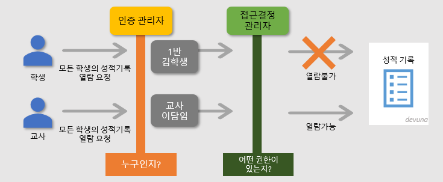
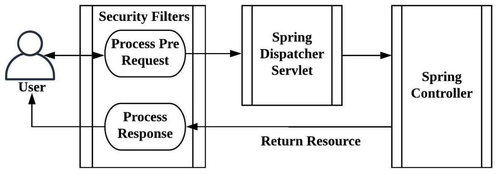
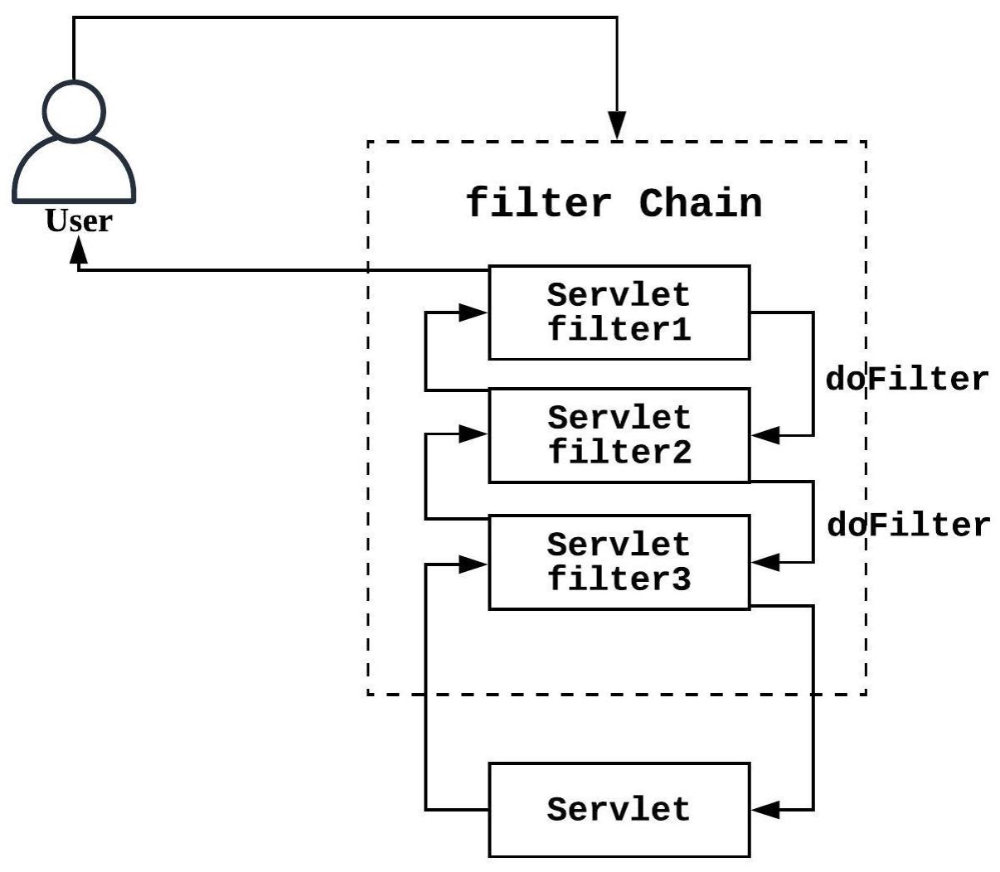
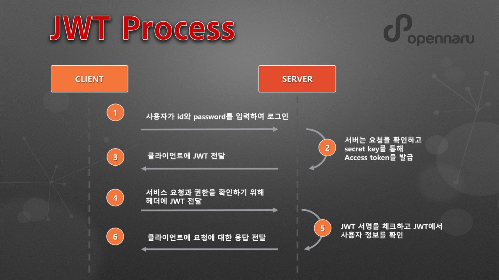

# ch9

spring boot REST API Web 프로젝트 (9-1) - 스프링 시큐리티 & Json Web Token을 이용해 인증, 인가, 권한 부여

## 스프링 시큐리티란 (Spring Security)

> 스프링 security는 스프링 기반의 애플리케이션의 보안(인증과 권한, 인가)를 담당하는 스프링 하위 프레임워크이다.

인증 : Authenticate (누구인가?)
인가 : Authorize (뭘 할 수 있는가?)
두 보안을 담당한다.
스프링 시큐리티를 사용하지 않으면

매 요청마다 세션을 검사해야한다. (Authenticate)
매 요청마다 유저의 권한을 검사해야한다. (Authorize)
스프링 시큐리티는 Filter(필터)를 사용해서 이 부분을 해결한다.

## 기본 용어 설명

- 접근주체 (principal) : 보호된 리소스에 접근하는 대상
- 인증 (Authentication) : 보호된 리소스에 접근한 대상에 대해 누구인지, 애플리케이션의 작업을 수행해도 되는 주체인지 확인하는 과정
- 인가 (Authorize) : 해당 리소스에 대한 접근 가능한 권한을 가지고 있는지 확인하는 과정
- 권한 : 어떠한 리소스에 대한 접근 제한, 모든 리소스는 접근 제어 권한이 걸려있다.

## 스프링 시큐리티 특징과 구조

- 보안과 관련해서 체계적으로 많은 옵션을 제공한다.
- filter기반으로 동작하여 MVC와 분리하여 관리 및 동작한다.
- 애노테이션을 통한 간단한 설정이 가능하다
- 스프링 시큐리티는 세션 & 쿠키 방식으로 인증한다

- 리소스 접근 관리
  - 인증관리자 : UsenamePasswordAuthenticationFilter
  - 접근결정 관리자 : FilterSecurityInterceptor

## 스프링 시큐리티 작동 구조

> 스프링 시큐리티 사용시 스프링은 DispatcherServlet 앞단에 Filter를 배치시켜서 요청을 가로챈다. 클라이언트에 접근 권한이 없다면 인증화면으로 자동 리다이렉트 시킨다.

## 스프링 시큐리티 필터

> SpringSecurity는 기능별 필터의 집합으로 되어있고 그 필터의 종류도 매우다양하지만, 중요한 것은 처리 순서에 있다.
> [servlet-security-filters](https://docs.spring.io/spring-security/site/docs/current/reference/html5/#servlet-security-filters)

클라이언트가 리소스를 요청할 때 접근 권한이 없는 경우 기본적으로 로그인 폼으로 보내게 되는데 그 역활을 하는 Filter가 UsernamePasswordAuthenticationFilter이다.

RestAPI 구조에서는 로그인 폼이 따로 존재하지 않으므로 인증권한이 없다는 오류를 JSON 형태로 반환해줘야 한다. 따라서 UsernamePasswordAuthenticationFilter가 작동하기 전에 해당 처리를 해줘야 한다.

## Json Web Token을 통해 API 인증 및 권한 부여

- 인증을 위한 Login, Signup API를 구현
- 가입시 제한된 리소스에만 접근 가능하도록 ROLE_USER 권한을 회원에게 부여
- 스프링 시큐리티에서 접근제한이 필요한 리소스에 대해서 ROLE_USER 권한을 가져야 접근이 가능하도록 한다.
- 권한을 가진 회원이 로그인 성공시에는 리소스에 접근할 수 있는 Jwt 토큰을 발급해준다.
- Jwt 보안 토큰으로 회원은 권한이 필요한 Api 리소스를 요청해서 사용한다.

## JWT : Json Web Token

> 사용 예시 : 서버는 "관리자로 로그인됨"이라는 클레임이 있는 토큰을 생성하여 이를 클라이언트에 제공할 수 있다. 그러면 클라이언트는 해당 토큰을 사용하여 관리자로 로그인됨을 증명한다.

- 전자 서명 된 URL-safe(URL로 이용할 수있는 문자로만 구성된)의 JSON
- 토큰 자체에 데이터가 담겨있어서 클라이언트는 Jwt으로 서버에 권한이 필요한 리소스를 요청하고, api 서버는 Jwt이 유효한지 여부와, Jwt에 담긴 유저 정보를 확인해서 리소스를 제공할 수 있다.
- JWS + JWE 기술이 들어가있다. Json Web Signature (서명) + Encryption (암호화)

서버는 클라이언트의 로그인 정보를 저장하지 않고 토큰기반의 인증 메커니즘으로 작동되므로 무상태로(stateless) 작동된다.

## 토큰 전략 (Access Token + Refresh Token)

- 토큰은 일반적으로 편의성과 보안성을 위해 Access Token과 Refresh Token 두개를 갖게한다.
- Access Token의 expire 시간을 짧게, Refresh Token의 expire시간을 길게 잡으면 사용자의 편의와 보안을 높일 수 있다.
  - Access Token을 전송했을 때 만료시간으로 인해 실패한다면 Refresh Token을 확인한다.
  - Refresh token이 일치하고 만료되지 않았다면 Access Token을 자동발급해서 새로운 만료시간을 갖게해준다(사용자는 로그아웃 당하지 않음)
  - Access Token이 탈취당해도 만료시간이 짧으므로 보안성이 좋다. 하지만 Refresh Token이 탈취당하면 더 위험할 수 있는 문제가 있다

### 그렇다면 Refresh Token의 보안이 중요한데 어디에 저장하는게 좋을까?

- Local Storage : 자바스크립트로 접근이 매우쉽다. 따라서 공격에 취약하다
- Cookie : HTTP Only, Sercure 옵션을 사용하면 어느정도 보안이된다. 그래도 혹시 모른다...
- Server Side -> 결국은 서버로 돌아가게 된다. 서버의 무상태를 위한 Jwt이지만 보안을 위해 서버에 저장하게 되는 재밌는 상황이다.
  - 그래서 DB에 저장한다. DB에 실제 Refresh Token값을 저장하고 이 토큰이 저장된 DB의 Index값을 로컬스토리지나 쿠키에 저장하게 된다. 해당 쿠키의 만료시간을 1년으로 잡아버리면 항상 로그인 상태로 유지할 수도 있다.
  - 인덱스 값이 탈취당해도 단순 숫자에 불과하므로 DB가 해킹당하지 않는 이상 보안성이 매우 우수하다.
  - 인덱스값을 Hash처리해서 보관하면 더욱 우수한 보안을 가질 수 있다.
  - 그러면 DB는 리프레쉬 토큰을 보관하는 곳을 HashMap, HashTable로 구현하게 된다.
