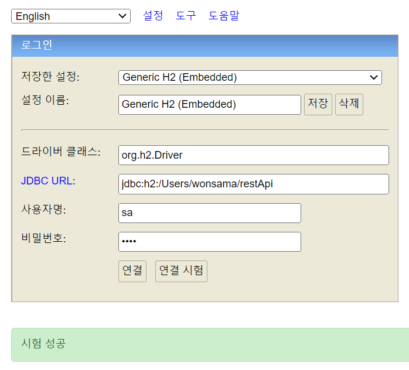

# h2-install

## H2 설치

[h2 다운로드](https://www.h2database.com/html/download-archive.html)

## H2 Database 생성

(windows)

- 설치 후 H2 Console 을 실행
- 실행 후 우측 하단 tray 영역 아이콘을 클릭
- `create a new database..` 를 선택

```txt
Database Path : /User/wonsama/restApi
Username : sa
Password : 1234
```

- 경로 지정 시 파일을 생성할 수 있는 권한이 있는 영역을 지정 해줘야 된다.
- `/Users/wonsama/` 경로에 `restApi.mv.db` 파일이 생성된 것을 확인 할 수 있다.

## 실행



## 참조링크

- [H2 설치 및 Database 생성](https://velog.io/@dailylifecoding/H2-h2-install-and-create-database)
